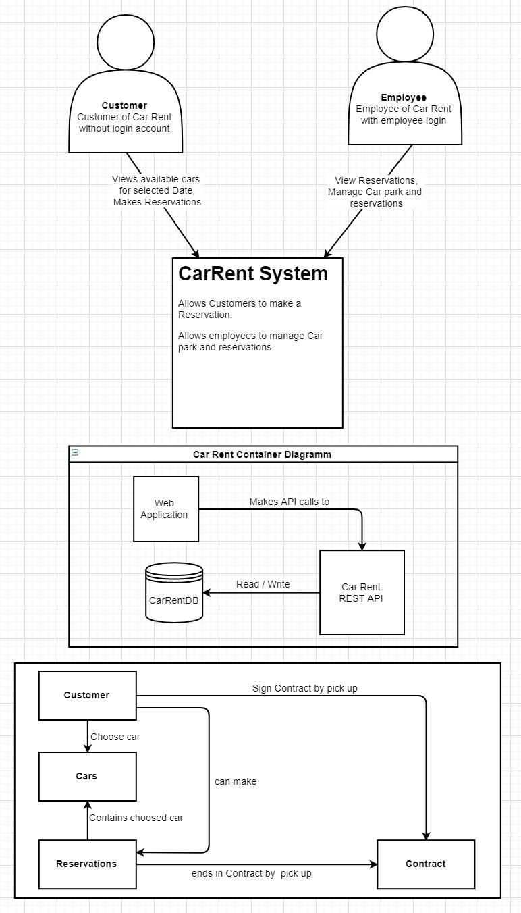
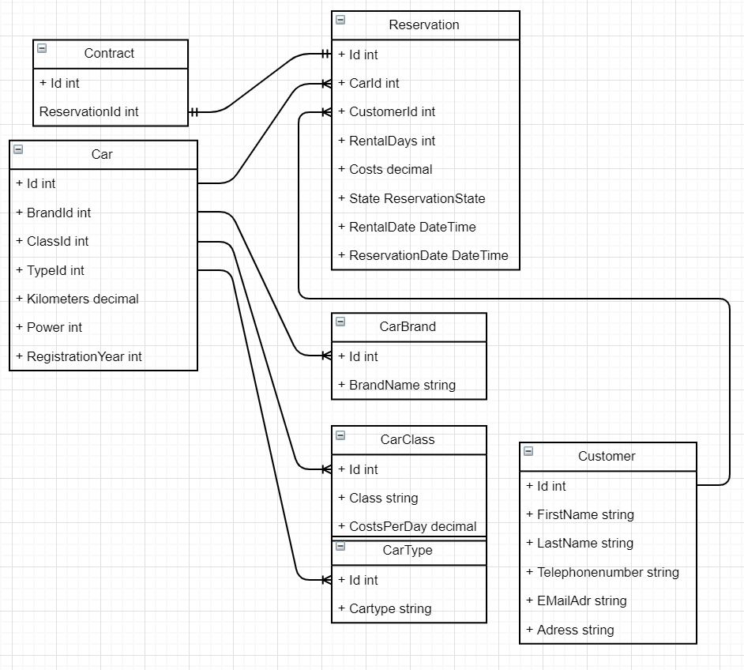

# Car Rent Api Documentation

# Aufgabenstellung
## Zielsetzung

Es soll ein Autovermietungssystem "Car Rent" erstellt werden. Das System soll aus einem Serverteil, welcher über eine RestApi erreicht werden kann, und aus einem optionalen Webclient bestehen.

# Context Diagram

Der Kunde kann bei einer Reservation ein Auto aus einer bestimmten Klasse wählen. Bei der Reservation muss er die Mietdauer und das Anfangsdatum angeben. 
Der Sachbearbeiter kann den Fuhrpark verwalten. Zudem kann er die Kunden im System verwalten und suchen.

# Container Diagram

Die Webaplikation macht API calls zur RestApi über welche Datenbankoperationen ausgeführt werden. Je nach Aufruf werden Daten geschrieben oder gelesen.

# Component Diagram

Der Kunde kann ein Auto auswählen und eine Reservation tätigen. Bei Abholung des Wagens muss der Kunde einen Vertrag unterschreiben. Die Reservation beinhaltet das ausgewählte Fahrzeug, das Reservationsdatum, die Mietdauer, die Gesamtkosten und der Mietzeitpunkt und den Reservationsstatus. Bei der Vertragserstellung ändert der Reservationsstatus zu Contracted. 

# Domain Diagram

# Activity Diagram Controller

# Use Cases

UC1: Der Sachbearbeiter kann Kunden erfassen, löschen bearbeiten und mittels Kundennummer oder Name suchen.

UC2: Der Sachbearbeiter kann Autos verwalten und suchen.

UC3: Jedes Auto besitzt eine Angabe bezüglich Klasse, Typ und Marke. Jedes Auto kann zudem eindeutig Identifiziert werden.

UC4: Die Klasse bestimmt den Tagespreis.

UC5: Bei der Reservation kann ein Auto aus einer bestimmten Klasse gewählt werden. Durch die Angabe der Reservationstage wird der Gesamtpreis berechnet. Der Reservationsstatus wird für den ausgewählten Reservationszeitraum auf reserviert gesetzt.

UC6: Beim erstellen des Mietvertrags, wird der Reservationsstatus auf Contracted gewechselt.

# RestApi

## Daten übergabewerte
Die Daten werden gemäss dem Domaindiagramm als json-Datei von der RestApi zurückgegeben. Bei Fremdschlüssel werden die Id's der als fremdschlüsselübergebenen Tabelle zurückgegeben.

### Ausnahme
Die Rückgabe des Contracts unterscheidet sich von den anderen. Hier werden die gejointen Werte zurück gegeben und nicht nur die Fremdschlüssel Id.

## Datenübergabe
Die Daten werden von der RestApi in Form von json-Dateien übernommen. Um die Tabellen zu verknüpfen müssen den entsprechenden Fremdschlüsselfelder die jeweiligen Id's der Daten aus der jeweiligen Tabelle übergeben werden.

## Datenbank
Die Datenbank wurde in Form eines Entity Frameworks umgesetzt. Das Entity Framework läuft als InMemoryDatenbank, wodurch es die Daten nur während die RestApi läuft hält. Dadurch werden beim Start der Api mehrere Beispieldaten übergeben.

## Controller
Die Controller sind alle auf die gleiche Art aufgebaut und bieten die Methoden Get, Put, Post und Delete an. Die einzigen Controller, welche sich zu den anderen Unterscheiden ist der Reservationscontroller und Contractcontroller.

### Reservationcontroller
Der Reservationcontroller überprüft vor einem Post den Reservationsstatus des ausgewählten Fahrzeugs. Die Reservation kann nur ausgelöst werden, wenn das Fahrzeug zu der Reservationszeit nicht reserviert ist.

### Contractcontroller
Der Contractcontroller unterscheidet sich zu den anderen Controllern, indem er bei einem Get eine gejointe Klasse der Foreign Keys zurückgibt.

# Continuous Integration

Die Continuous Integration wurde mittels einer Azure Pipeline umgesetzt. Diese Pipeline startet bei jedem Push in den Master-Branch von Git einen automatischen Build und führt die Tests durch.

# Test

## Tests
Es werden ausschliesslich Integrationstests durchgeführt, da keine wirkliche Businesslogik vorhanden ist. Die einzelnen Tests überprüfen, ob von den Controllern die richtigen Daten ausgegeben, eingefügt geupdated oder gelöscht werden. 

## Testplan
Die Tests werden bei jedem Commit in den Master-Branch von der Azure-Pipeline ausgelöst.
