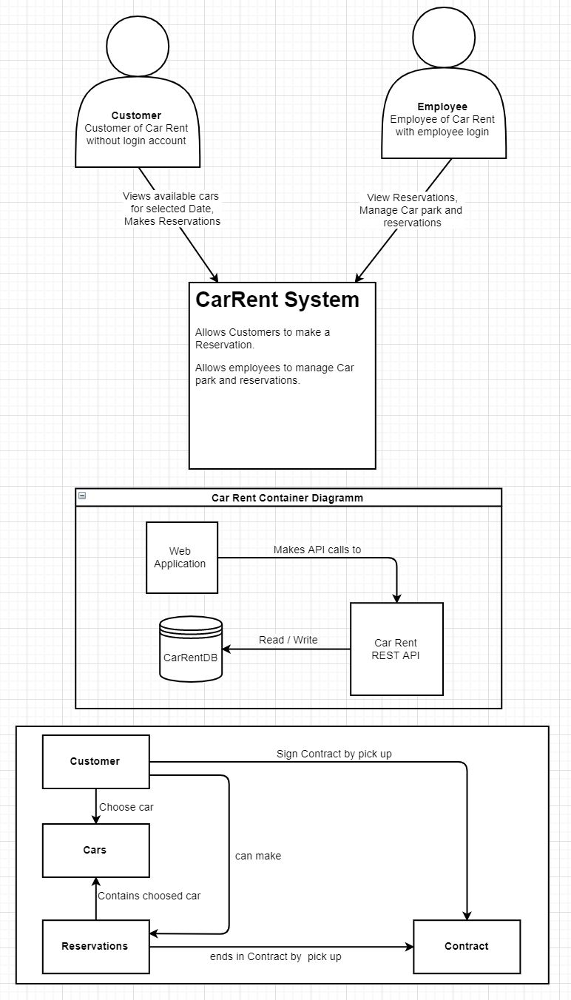
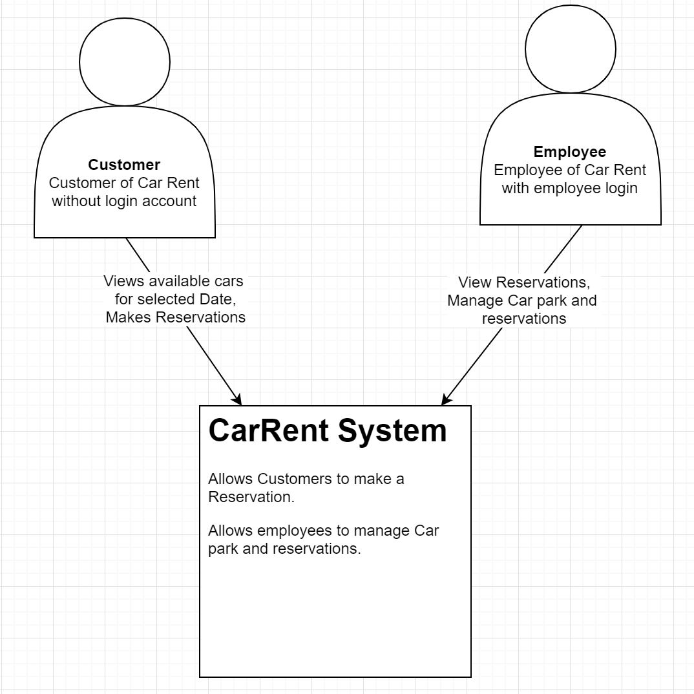
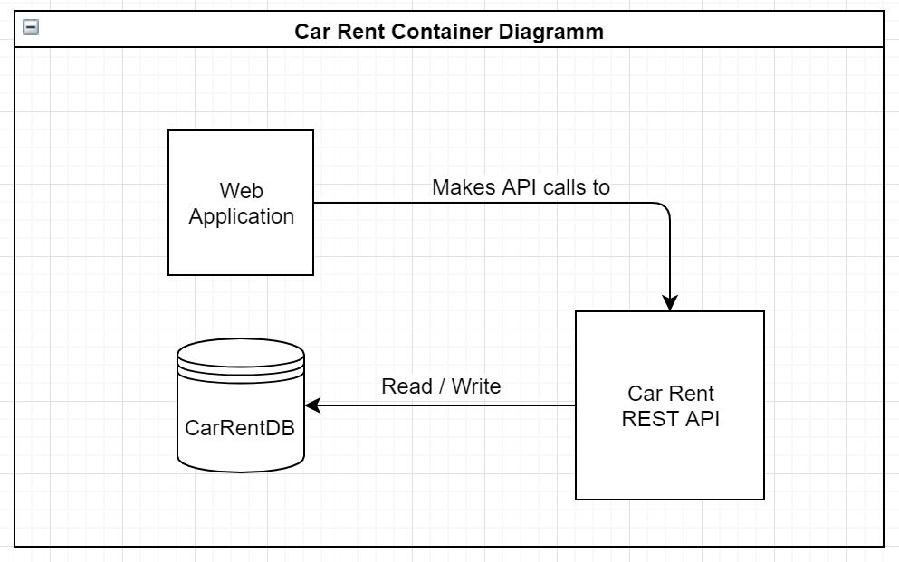
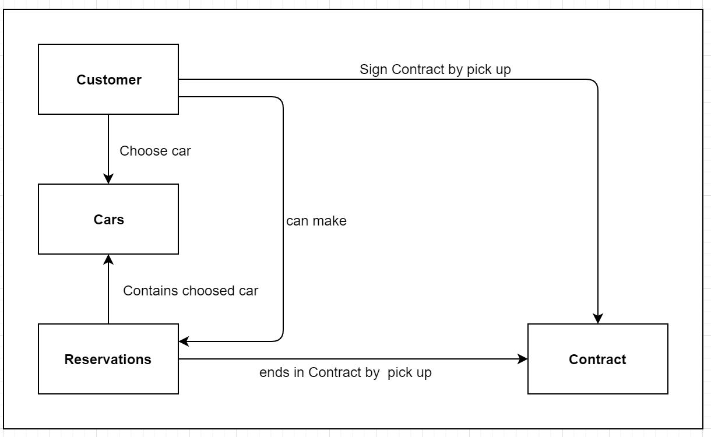

# Car Rent Api Documentation

# Context Diagram

Der Kunde kann bei einer Reservation ein Auto aus einer bestimmten Klasse wählen. Bei der Reservation muss er die Mietdauer und das Anfangsdatum angeben. 
Der Sachbearbeiter kann den Fuhrpark verwalten. Zudem kann er die Kunden im System verwalten und suchen.

# Container Diagram

Die Webaplikation macht API calls zur RestApi über welche Datenbankoperationen ausgeführt werden. Je nach Aufruf werden Daten geschrieben oder gelesen.

# Component Diagram

Der Kunde kann ein Auto auswählen und eine Reservation tätigen. Bei Abholung des Wagens muss der Kunde einen Vertrag unterschreiben. Die Reservation beinhaltet das ausgewählte Fahrzeug, das Reservationsdatum, die Mietdauer, die Gesamtkosten und der Mietzeitpunkt und den Reservationsstatus. Bei der Vertragserstellung ändert der Reservationsstatus zu Contracted. 

# Domain Diagram

#Use Cases

UC1: Der Sachbearbeiter kann Kunden erfassen, löschen bearbeiten und mittels Kundennummer oder Name suchen.

UC2: Der Sachbearbeiter kann Autos verwalten und suchen.

UC3: Jedes Auto besitzt eine Angabe bezüglich Klasse, Typ und Marke. Jedes Auto kann zudem eindeutig Identifiziert werden.

UC4: Die Klasse bestimmt den Tagespreis.

UC5: Bei der Reservation kann ein Auto aus einer bestimmten Klasse gewählt werden. Durch die Angabe der Reservationstage wird der Gesamtpreis berechnet. Der Reservationsstatus wird für den ausgewählten Reservationszeitraum auf reserviert gesetzt.

UC6: Beim erstellen des Mietvertrags, wird der Reservationsstatus auf Contracted gewechselt.
